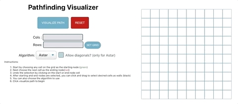

# Pathfinding Visualizer

## Content Page
  * [Description](#description)
  * [Features](#features) 
  * [Algorithms](#algorithms)
  * [Technologies](#technologies)

### Description

Welcome to my pathfinding visualizer. I built this application to better understand how pathfinding algorithms work and to see them in action !

To check it out, here's the link: [Pathfinding Visualizer](https://pathfind-alv.netlify.app/)

---

### Features

1. Setting of walls/obstacles to better visualize the pathfinding algorithm
2. Start / End node / walls are removable
3. Toggle allowance of diagonal traversals for A* Search
4. Toggle algorithm to use - A* or Dijkstra
5. Set grid size
6. Reset grid

---

### Algorithms

Dijkstra's Algorithm: One of the first shortest path first(SPF) algorithm which guarantees the shortest path

A* Search(without diagonals): A modified version of Dijkstra's Algorithm, it uses heuristics(Manhattan) to guarantee the shortest path much faster than Dijkstra's 
Algorithm

A* Search(with diagonals): Same as above but much faster as it allows diagonal traversals. Uses Euclidean heuristics to guarantee a shorter path. 

---

### Technologies

Tech stacks used: ReactJS, Javascript, CSS

---

